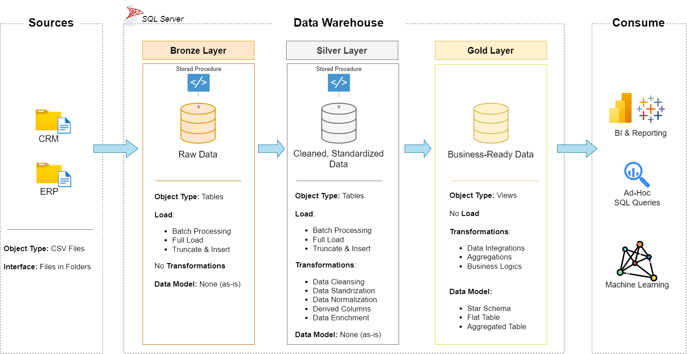

# 🏗️ Data Warehouse Project

## 📌 Overview

This project is a **Data Warehouse Implementation** built using **SQL Server**.
It follows the **Medallion Architecture** (Bronze → Silver → Gold) to ensure clean, reliable, and business-ready data for analytics and reporting.

The repository contains scripts for:

* **Bronze Layer** → Raw data ingestion from multiple sources (CRM, ERP).
* **Silver Layer** → Data cleaning, transformations, and business logic.
* **Gold Layer** → Final dimension and fact tables for business reporting.

---

## 📂 Project Structure

```plaintext
📦 data-warehouse-project
 ┣ 📜 README.md
 ┣ 📜 bronze_load.sql        # Procedures for loading raw data
 ┣ 📜 silver_load.sql        # Procedures for cleaning & transforming data
 ┣ 📜 gold_views.sql         # Views for business-friendly dimensions & facts
 ┣ 📂 datasets/              # Source CSV files (CRM, ERP)
 ┣ 📂 docs/                  # Documentation & design notes
 ┃ ┣ 📊 data_flow.png
 ┃ ┣ 🏗️ data_architecture.png
 ┃ ┗ 🔗 layer_relationships.png
```

---

## 🪙 Bronze Layer

* Ingests raw CSV data from CRM and ERP systems.
* Uses `BULK INSERT` for efficient data loading.
* Captures **batch\_start\_date** and **batch\_end\_date** for auditing.
* Implements **TRY...CATCH** with detailed logging.

📌 Example:

```sql
PRINT '>> Truncating Table : bronze.crm_cust_info';
TRUNCATE TABLE bronze.crm_cust_info;

PRINT '>> Inserting data into : bronze.crm_cust_info';
BULK INSERT bronze.crm_cust_info
FROM 'datasets/source_crm/cust_info.csv'
WITH (FIRSTROW = 2, FIELDTERMINATOR = ',', TABLOCK);
```

---

## ⚙️ Silver Layer

* Cleans and standardizes raw data.
* Handles **nulls, invalid dates, gender standardization, marital status mapping**.
* Applies **ROW\_NUMBER()** for deduplication.
* Ensures referential integrity between CRM & ERP datasets.

📌 Key Features:

* `crm_cust_info` → Deduplicated customers with enriched attributes.
* `crm_prd_info` → Product details with start/end dates.
* `crm_sales_details` → Validated sales records with corrected amounts.
* ERP tables cleaned for **country codes, gender, and IDs**.

---

## 📊 Gold Layer

* Provides **business-friendly views** for analytics.
* Follows **Star Schema** design:

  * `dim_customers`
  * `dim_products`
  * `fact_sales`

📌 Highlights:

* Surrogate keys (`ROW_NUMBER()`) for dimensions.
* Fact table joins dimensions via natural/business keys.
* Only **current data** is retained (historical data filtered out).

---

## 🖼️ Visuals

### 📊 Data Flow


### 🏗️ Data Architecture



### 🔗 Layer Relationships


---

## 🚀 How to Run

1. Clone the repository:

   ```bash
   git clone https://github.com/yourusername/data-warehouse-project.git
   ```
2. Open SQL Server Management Studio (SSMS).
3. Execute scripts in the following order:

   * `bronze_load.sql` → Load raw data.
   * `silver_load.sql` → Clean and transform data.
   * `gold_views.sql` → Create reporting views.

---

## 📈 Business Benefits

✔️ Unified and consistent data model.
✔️ Reliable reporting with clean dimensions & facts.
✔️ Audit-friendly with batch tracking.
✔️ Visualized data architecture for better understanding.
✔️ Flexible design for future scalability.

---

## 📜 License

This project is licensed under the **MIT License** – see the [LICENSE](LICENSE) file for details.

---


